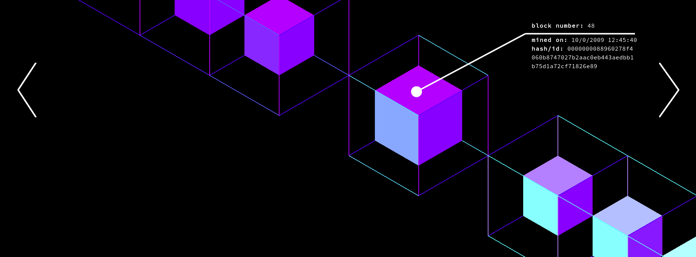

# Messages from the Mines
### (front end)

Messages from the Mines is an interactive art installation and accompanied print book which excavates and interprets custom messages embedded in the Bitcoin blockchain. The distributed ledger contains hidden love messages, cryptic poems, ascii art, signatures, eulogies and more. These messages are a creative abuse of the transaction protocol, a form of digital graffiti, unique—though overlooked—cultural artifacts forever embedded in one of the most contemporary digital technologies.

**...this is a work in progress...**
